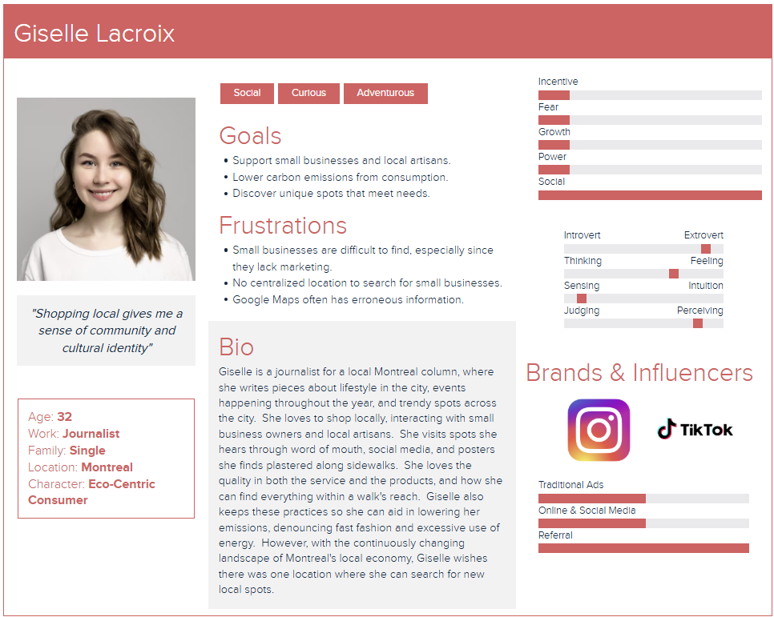

# Initial Design Phases

----

## 1. User Personas

### (a) The Long-Time Small Business Owner - Maximiliano Vendetta

### (b) The First-Time Small Business Owner - Philippe Belanger

### (c) The Eco-centric Consumer - Giselle Lacroix

### (d) The Non-Local Shopper - Samantha Lee

----

## 2. User Journey Diagram

### (a) From the Perspective of Maximiliano

### (b) From the Perspective of Philippe

### (c) From the Perspective of Giselle

### (d) From the Perspective of Samantha

----

## 3. User Flow Diagram

----

## 4. Storyboards

### (a) The use of the LocalHero Application from an Artisan's Perspective

### (b) The use of the LocalHero Application from a Consumer's Perspective

----

## 5. Sketches

### (a) Landing Page

### (b) Login Page

### (c) Sign Up Page

### (d) Small Business/Local Artisan Search Page

### (e) Filter by Location Component

### (f) Business/Artisan Management Page

### (g) Add/Edit Component

----

## 6. Wireframes

### (a) Landing Page Wireframe

### (b) Search Page Wireframe

### (c) Management Page Wireframe

----

## 7. Mockups

### (a) Landing Page Mockup

### (b) Small Business Search Page Mockup

### (c) Local Artisan Search Page Mockup

### (d) Small Business Management Page Mockup

### (e) Local Artisan Management Page Mockup

